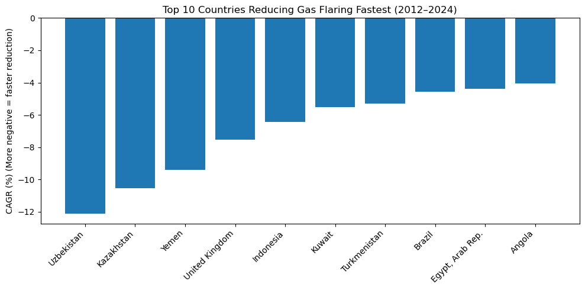
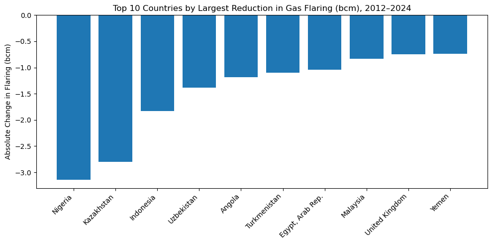
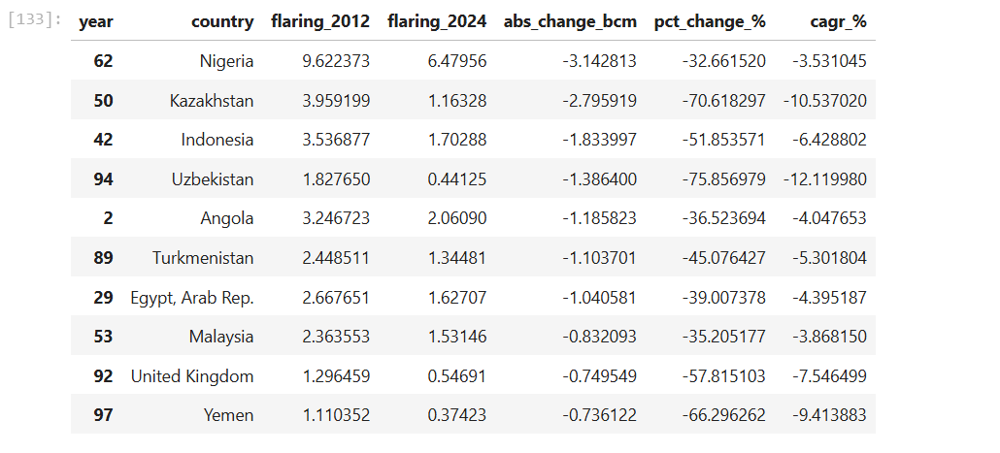

# Which Countries Are Improving Fastest in Reducing Gas Flaring? (2012–2024)

## 📌 Business Problem
Gas flaring — the burning of associated gas during oil production — remains a major environmental and economic issue. 

It contributes to:
- CO₂ and methane emissions
- Air pollution
- Energy waste
- Lost economic value

Reducing flaring is a key target in global climate commitments and energy transition strategies.

This project answers the central question:

**Which countries have improved the fastest in reducing gas flaring between 2012 and 2024?**

## 🎯 Objective
To identify and rank countries based on:
- Absolute reduction in flaring volume (billion cubic meters, bcm)
- Percentage reduction
- Compound Annual Reduction Rate (CAGR)
- Trend consistency over time

The goal is to distinguish between:
- Countries achieving large structural reductions
- Countries with short-term or inconsistent declines


## 📂 Data Source
- Gas flaring data (billion cubic meters — bcm) was obtained from:

**World Bank Global Gas Flaring Tracker**

- Time period analyzed:
**2012–2024**

- Data structure:
Country
Year
Flaring volume (bcm)

## Tools Used
- Python
- Pandas
- NumPy
- Matplotlib / Seaborn

## 🧹 Data Cleaning & Preparation (Python)

Steps performed:

1. Loaded dataset into Pandas

2. Removed:

- Empty rows
- Total / aggregated rows

3. Reshaped data from wide to long format
   
4. Filtered years between 2012 and 2024
   
5. Calculated reduction metrics:
- Absolute change (bcm)
- Percentage change (%)
- Compound annual reduction rate (CAGR)
  
Reduction Formulas Used

```wide["abs_change_bcm"] = wide[2024] - wide[2012]```
```wide["pct_change_%"] = (wide[2024] / wide[2012] - 1) * 100```
```wide["cagr_%"] = ((wide[2024] / wide[2012]) ** (1/12) - 1) * 100```


CAGR was calculated across a 12-year period.
Negative values indicate flaring reduction.


## 📊 Analysis & Visualizations

#### 1️⃣ Fastest Percentage Reductions (CAGR %)




This visualization ranks countries by compound annual reduction rate.

##### 📌 What this measures:

Speed of improvement over time.

##### Key Findings

- **Uzbekistan is the fastest improver (most negative CAGR, ~-12%/yr)**. This means it reduced flaring at the quickest average annual rate over the period.

- **Kazakhstan and Yemen also show very strong improvement rates (around -10% and -9% per year)**, meaning their flaring levels fell rapidly relative to where they started.

- **Countries like United Kingdom and Indonesia appear high on this list** even though they may not be the biggest flarers globally—because this ranking is about rate of reduction, not total volume.

- **The later entries (Brazil, Egypt, Angola) are still improving**, but at a slower yearly pace (around -4%/yr). They are reducing flaring, just not as aggressively as the top countries.

Fastest improvement is concentrated in countries that achieved sustained year-on-year reductions, indicating strong operational upgrades, enforcement, or gas utilization investments.
 
⚠️ Smaller initial volumes can exaggerate percentage changes.


#### 2️⃣ Largest Absolute Reductions (bcm)



This visualization ranks countries by total flaring reduction in volume terms.

##### 📌 What this measures:

Total contribution to global flaring reduction.

##### Key Findings
- **Nigeria shows the largest absolute reduction in flaring volume (biggest drop in bcm)**. This means Nigeria delivered the most “real-world” reduction in total gas flared among the top reducers.

- **Kazakhstan and Indonesia also reduced large volumes**, suggesting that improvements occurred in countries with historically significant flaring.

**This chart highlights impact at scale: countries can reduce a lot of flaring volume even if their percentage reduction is not the fastest.**

- **Some countries (e.g., United Kingdom, Yemen)** appear here with smaller absolute reductions—showing that they improved, but their total flaring volumes were lower compared to major flaring countries.

Absolute reductions identify where the largest emissions and waste savings occurred, which is more relevant for global impact than growth-rate rankings.


#### 3️⃣ Time-Series Trends (2012–2024)



A trend visualization tracks flaring changes year-by-year.

##### Observations

**Uzbekistan and Kazakhstan** lead in the speed of improvement, while Nigeria and Kazakhstan lead in total volume reduced, showing that the fastest improvers are not always the largest contributors by volume.

**Several countries show steady structural decline.**

**Some exhibit volatility linked to:**

  - Oil production fluctuations
  - Infrastructure expansion delays
  - Policy shifts
- COVID-related production slowdown influenced temporary reductions in 2020.

## Overall Findings
1. Structural flaring reductions are concentrated in a subset of producing countries.
2. Percentage improvements differ from absolute environmental impact.
3. High-flaring countries contribute most to global reduction when improvements occur.
4. Some reductions may be linked to lower oil production rather than improved capture technology.
5. Flaring reduction progress remains uneven across producers.

## Limitations
**1. The analysis does not adjust for:**
- Oil production levels
- Changes in associated gas output
- Field maturity differences
  
**2. Reductions may result from:**
- Production declines rather than improved gas capture.

**3. Data does not distinguish between:**
- Routine flaring
- Emergency flaring

**4. 2024 data may be provisional.**

**5. Environmental impact (CO₂ equivalent) was not directly calculated.**

## Conclusion
Between 2012 and 2024, several oil-producing countries demonstrated measurable progress in reducing gas flaring.

While percentage-based rankings highlight rapid improvements in some economies, absolute reductions reveal that major producing countries drive the largest environmental gains.

The distinction between reduction speed and reduction scale is critical when evaluating global climate impact.

Continued infrastructure investment, regulatory enforcement, and associated gas commercialization will determine whether flaring reduction trends are sustained.

